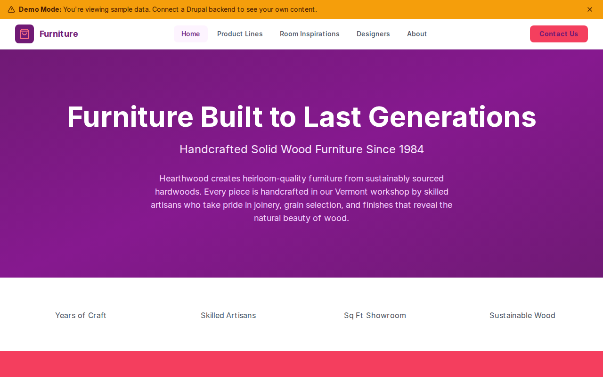

# Decoupled Furniture

A handcrafted furniture store website built with Next.js and Decoupled Drupal, designed for furniture makers, showrooms, and home furnishing brands to showcase collections, room inspiration, and their design team.



[](https://vercel.com/new/clone?repository-url=https://github.com/nicholasio/decoupled-furniture&project-name=decoupled-furniture)

## Features

- Showcase curated **product lines** with materials, price ranges, and style descriptions
- Display **room inspiration** galleries with featured pieces, color palettes, and budget ranges
- Highlight furniture **designers** with roles, specialties, and experience
- Dynamic homepage with hero section, statistics, and showroom call-to-action
- Static **pages** for about, contact, and FAQ

## Quick Start

### 1. Clone the template

```bash
npx degit nicholasio/decoupled-furniture my-furniture
cd my-furniture
npm install
```

### 2. Run interactive setup

```bash
npm run setup
```

### 3. Start development

```bash
npm run dev
```

Visit [http://localhost:3000](http://localhost:3000)

---

## Manual Setup

<details>
<summary>Click to expand manual setup steps</summary>

### Authenticate with Decoupled.io

```bash
npx decoupled-cli@latest auth login
```

### Create a Drupal space

```bash
npx decoupled-cli@latest spaces create "Hearthwood Furniture"
```

Note the space ID returned (e.g., `Space ID: 1234`). Wait ~90 seconds for provisioning.

### Configure environment

```bash
npx decoupled-cli@latest spaces env 1234 --write .env.local
```

### Import content

```bash
npm run setup-content
```

This imports the following sample content:

- **Product Lines:** Vermont Modern ($1,200-$8,500), Farmstead ($800-$6,500), Studio ($600-$4,200)
- **Room Inspiration:** Modern Living Room, Farmhouse Dining Room, Studio Apartment Bedroom
- **Designers:** Anna Lindberg (Head of Design), Robert Kessler (Master Craftsman), Mei Tanaka (Interior Design Director)
- **Pages:** About Hearthwood Furniture, Contact Us, Frequently Asked Questions
- **Homepage:** Hero section, statistics (40+ Years, 60 Artisans, 15,000 Sq Ft Showroom, 100% Sustainable Wood), and showroom CTA

</details>

## Content Types

### Product Line

A curated furniture product line or collection.

| Field | Type | Description |
|-------|------|-------------|
| tagline | string | Collection tagline |
| price_range | string | Price range for the collection |
| materials | string[] | Wood species and materials used |
| style | string | Design style category |
| piece_count | integer | Number of pieces in collection |
| image | image | Collection showcase image |
| body | text | Full collection description |

### Room Inspiration

A curated room design showcasing furniture in context.

| Field | Type | Description |
|-------|------|-------------|
| room_type | string | Type of room (Living Room, Bedroom, etc.) |
| design_style | string | Interior design style |
| budget_range | string | Estimated budget range |
| featured_pieces | string[] | Furniture pieces featured |
| color_palette | string | Color palette description |
| image | image | Room photo |
| body | text | Design details and tips |

### Designer

A furniture designer or interior design consultant.

| Field | Type | Description |
|-------|------|-------------|
| role | string | Job title |
| specialty | string | Area of expertise |
| years_experience | integer | Years of professional experience |
| education | string | Educational background |
| photo | image | Designer headshot |
| body | text | Full biography |

### Homepage

Landing page with hero section, statistics, and call-to-action areas.

| Field | Type | Description |
|-------|------|-------------|
| hero_title | string | Hero headline |
| hero_subtitle | string | Hero subheading |
| hero_description | text | Hero body text |
| stats_items | paragraph(stat_item)[] | Key statistics |
| featured_items_title | string | Featured section title |
| cta_title | string | CTA section title |
| cta_description | text | CTA body text |
| cta_primary | string | Primary button label |
| cta_secondary | string | Secondary button label |

### Basic Page

Static content pages for about, contact, FAQ, policies, etc.

| Field | Type | Description |
|-------|------|-------------|
| body | text | Page content |

## Customization

### Colors & Branding

Edit `tailwind.config.js` to customize colors, fonts, and spacing for your furniture brand.

### Content Structure

Modify `data/furniture-content.json` to update collections, room designs, designers, and other sample content.

### Components

React components are in `app/components/`. Update them to match your showroom's design and aesthetic.

## Demo Mode

### Enable Demo Mode

Set the environment variable:

```bash
NEXT_PUBLIC_DEMO_MODE=true
```

Or add to `.env.local`:

```
NEXT_PUBLIC_DEMO_MODE=true
```

### What Demo Mode Does

- Shows a "Demo Mode" banner at the top of the page
- Returns mock data for all GraphQL queries
- Displays sample collections, room inspiration, and designer profiles
- No Drupal backend required

### Removing Demo Mode

To convert to a production app with real data:

1. Delete `lib/demo-mode.ts`
2. Delete `data/mock/` directory
3. Delete `app/components/DemoModeBanner.tsx`
4. Remove `DemoModeBanner` from `app/layout.tsx`
5. Remove demo mode checks from `app/api/graphql/route.ts`

## Deployment

### Vercel (Recommended)

[](https://vercel.com/new/clone?repository-url=https://github.com/nicholasio/decoupled-furniture)

Set `NEXT_PUBLIC_DEMO_MODE=true` in Vercel environment variables for a demo deployment.

### Other Platforms

Works with any Node.js hosting platform that supports Next.js.

## Documentation

- [Decoupled.io Docs](https://www.decoupled.io/docs)
- [Next.js Documentation](https://nextjs.org/docs)
- [Drupal GraphQL](https://www.decoupled.io/docs/graphql)

## License

MIT
